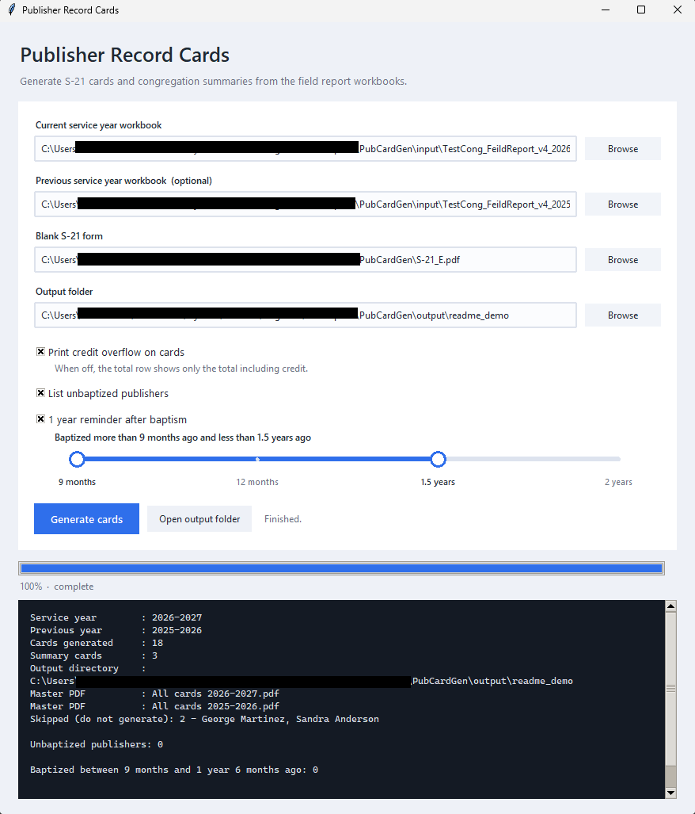

# PubCardGen

Generates the S-21 *Congregation's Publisher Record* cards, as filled-in PDFs, straight from the congregation's field report workbook. One card per publisher, plus congregation summary cards, filed into folders that match the way the cards are kept.

No typing, no copy-paste: the workbook you already maintain each month is the only data source.



---

## Start here - no Python, no command line

Everything below needs nothing but Windows and three downloads. (If you would rather run from the source code, skip to [Running from source](#running-from-source).)

**1. Download the app.** Get `PubCardGen.exe` from the [latest release](../../releases/latest) and put it in a folder of its own - say `Documents\PubCardGen`. There is nothing to install.

The first time you run it Windows may say *"Windows protected your PC"*, because the file is not code-signed. Choose **More info** and then **Run anyway**. For the same reason a few antivirus products are suspicious of self-contained apps like this one; if yours quarantines the file, allow it.

**2. Download the blank S-21 form.** Get *S-21 Congregation's Publisher Record* (the 11/23 edition) from jw.org and save it beside the app as `S-21_E.pdf`. The form is published by the organization, so it is not included here. Keep that exact file name and the app finds it by itself.

**3. Download a workbook to fill in.** Open [input/TestCong_FeildReport_v4_2026-2027.xlsm](input/TestCong_FeildReport_v4_2026-2027.xlsm), click the download button, and save it beside the app. It comes with invented publishers and figures so you can see what goes where. Then either clear it out and enter your congregation's data, or use your existing field report workbook if you already keep one in this format.

**Rename it for your service year.** The app reads the service year from the file name, so it must contain something like `2026-2027`. `FeildReport_v4_2026-2027.xlsm` works; `FieldReport.xlsm` does not.

**4. Run it.** Double-click `PubCardGen.exe` and follow [Using the window](#using-the-window).

That is the whole setup. Next year you copy the workbook, rename it to the new service year, and point the app at both files to get the two-page cards.

## Filling in the workbook

The workbook has one sheet per month, `Sep` through `Aug`, plus a `PubInfo` sheet that holds the roster. Rules, from the original workbook:

1. Enter data only in the blue coloured cells for each month.
2. New rows can be added to accommodate new publishers.
3. Rows can be deleted when a publisher moves out.
4. Rows can be shuffled when publishers change group.
5. Do not add, delete or rename sheets.
6. Keep publisher information up to date in the `PubInfo` sheet. When somebody moves out, their name can be deleted there.
7. Be consistent with publisher names - the name is what ties a monthly report to the person.

On the name in rule 7: leading and trailing spaces and upper or lower case do not matter, but anything else does. *Bro. John Smith* in January and *John Smith* in February count as two different people.

**Month sheets.** Headers on row 4, data from row 5. Reading stops at the first blank name, so the OLD REPORTS and TOTALS blocks lower down are ignored on purpose.

| A | B | C | D | E | F | G | H | I |
|---|---|---|---|---|---|---|---|---|
| Sl No | Name | Group | Status (`AP`/`RP`/`SP`/`FM`) | Shared (`YES`) | Bible studies | Hours | Remarks | Credit |

**PubInfo sheet.** The roster, and the only place the card's personal details and tick boxes come from.

| A | B | C | D | E | F | G | H | I |
|---|---|---|---|---|---|---|---|---|
| Name | Date of birth | Date of baptism | Male/Female | Other sheep/Anointed | Elder/MS | RP status (`RP`/`SP`/`FM`) | Group | `Do not generate Card` |

Somebody marked `Do not generate Card` still counts in the congregation summaries; they just get no card of their own.

## Using the window

1. **Current service year workbook** - browse to this year's field report workbook.
2. **Previous service year workbook** - optional. When set, every card gets last year's record as a second page, exactly as the printed cards are kept. The two workbooks have to be consecutive service years; if the file names say otherwise the run stops before anything is read.
3. **Blank S-21 form** - already filled in if `S-21_E.pdf` sits beside the app.
4. **Output folder** - defaults to an `output` folder beside the app. Anything already there with the same name is overwritten.
5. Optional switches:
   - **Print credit overflow on cards** - off leaves only *"Total including credit = X"* in the total row, without the *"; Credit overflow = Y"* half.
   - **List unbaptized publishers** - lists everyone with a card but no baptism date.
   - **1 year reminder after baptism** - drag the two handles to pick a window (9 months, 12 months, 1.5 years, 2 years) and the run lists everyone baptized inside it, oldest first. Handy for the one-year-after-baptism follow-up.
6. **Generate cards**. The progress bar tracks one step per card plus the summaries and the master PDFs, and the black panel below it reports what happened, with any warnings in red. **Open output folder** appears when it finishes.

## What comes out

```text
output/
  All cards 2026-2027.pdf              every card + the 3 summaries, ready to print
  All cards 2025-2026.pdf              the same for last year (only if you picked a second workbook)
  Summary 1 - Pioneers.pdf
  Summary 2 - Auxiliary Pioneers.pdf
  Summary 3 - All Other Publishers.pdf
  By group/
    North Group/Brian Perez.pdf
  By filing order/
    1 - Pioneers/Maria Johnson.pdf
    2 - Publishers/North Group/Brian Perez.pdf
```

Every card is written twice, once under each tree, so you can either hand a group overseer their whole group or file the cards the way the secretary keeps them. The summary cards use the same S-21 layout: one line per month with the number reporting, the studies and the hours for each of the three categories.

## Rules the generator follows

- **The card checkboxes come only from PubInfo.** Gender, hope, appointment, pioneer status and the filing section are never guessed from a month sheet.
- **The summaries follow how someone actually served that month.** Somebody who auxiliary pioneered in April is counted under *Auxiliary Pioneers* for April and as a publisher the rest of the year, falling back to their PubInfo standing when the month says nothing.
- **`Do not generate Card`** means exactly that: no card of their own, but their figures still count in the summaries.
- **Credit hours** apply only to a pioneer month and only up to 55 hours: `applied = min(credit, max(0, 55 - hours))`. What is left over is the overflow. The total row then reads *"Total including credit = X; Credit overflow = Y"*. The summary cards deliberately exclude credit so they tie out with the workbook's own totals block.
- **Last year's page** keeps this year's personal details but last year's appointment and pioneer status - that is what the printed card shows. Publishers who are new this year get one page.

## Warnings you may see

| Message | What it means |
|---|---|
| *"names in PubInfo have no report in any month sheet"* | They are on the roster but reported nothing all year, so their card is blank. |
| *"names report in the month sheets but are missing from PubInfo"* | Most likely someone who moved away mid-year. Their figures are counted in the summaries, but they get no card. Add them back to PubInfo if they still need one. |
| *"names in last year's PubInfo are no longer in PubInfo and filed no report"* | They left before the service year started. Nothing to do. |
| *"Skipped (do not generate)"* | The people ticked in PubInfo column I. |
| *"New this year"* | No previous record and no previous reports, so their card is a single page. |

## Troubleshooting

- **`error: file not found`** - the path in the box is wrong, or the workbook is on a network drive that is not connected.
- **"Could not read a service year from the file name"** - rename the workbook so it contains the years, like `FeildReport_v4_2026-2027.xlsm`.
- **`PermissionError` while writing** - one of the PDFs is open in a viewer. Close it and rerun.
- **Text lands in the wrong place on the card** - your `S-21_E.pdf` is a different edition. The coordinates were measured from the 11/23 form; it has no fillable fields, so the data is stamped at fixed positions.
- **Somebody's hours are missing** - check the spelling of their name; the month sheet and PubInfo have to agree.

## Running from source

For anyone who would rather use Python than the packaged app. You need Python 3.11 or newer.

```powershell
python -m venv .venv
.\.venv\Scripts\Activate.ps1
pip install -r requirements.txt
python -m pubcardgen.gui
```

On Linux the window also needs the Tk bindings: `sudo apt install python3-tk`.

The same run from the command line, which is the quickest way to repeat it:

```powershell
python -m pubcardgen --current_workbook input\FeildReport_v4_2026-2027.xlsm `
                     --previous_workbook input\FeildReport_v4_2025-2026.xlsm `
                     --template S-21_E.pdf `
                     --out output
```

| Option | Meaning |
|---|---|
| `--current_workbook PATH` | This year's workbook. |
| `--previous_workbook PATH` | Last year's workbook; adds the second page. |
| `--template PATH` | Blank S-21 form. Default `S-21_E.pdf`. |
| `--out PATH` | Output directory. Default `output`. |
| `--year 2026-2027` | Override the service year; otherwise read from the file name. |
| `--group "North Group"` | Only this field service group. Repeat for several. |
| `--no_credit_overflow` | Leave the credit overflow figure off the cards. |
| `--list_unbaptized` | List carded publishers with no date of baptism. |
| `--baptism_reminder 9 18` | List publishers baptized between 9 and 18 months ago. |

Exit code is `0` on success, `1` if a file is missing or the two workbooks are not consecutive service years.

`input/` holds two sample workbooks, `TestCong_FeildReport_v4_2025-2026.xlsm` and `TestCong_FeildReport_v4_2026-2027.xlsm`, with invented names and figures, so the whole thing can be tried without touching real data. Real congregation workbooks belong in `private/`, which is git-ignored - as are `output/` and `S-21_E.pdf`.

## How it is put together

| File | Role |
|---|---|
| `pubcardgen/gui.py` | The tkinter window. Builds the same arguments the CLI takes and runs it on a worker thread. |
| `pubcardgen/__main__.py` | Command line, the output tree, and the reconciliation warnings. |
| `pubcardgen/excel_reader.py` | Reads PubInfo and the month sheets into `Publisher` / `MonthlyReport`. |
| `pubcardgen/models.py` | The data classes, plus the credit calculation. |
| `pubcardgen/summary.py` | The three congregation totals cards. |
| `pubcardgen/layout.py` | Every coordinate on the S-21 form. |
| `pubcardgen/renderer.py` | Draws the overlay with ReportLab and merges it onto the form with pypdf. |

Dependencies: `openpyxl`, `pypdf`, `reportlab` - all cross-platform, so the tool runs on Windows, macOS and Linux.

## Building the executable yourself

```powershell
pip install pyinstaller
pyinstaller --noconfirm --clean PubCardGen.spec
```

The result is `dist/PubCardGen.exe`, about 27 MB, with the Python runtime inside it. `run_gui.py` exists only as the entry point PyInstaller needs, and `PubCardGen.spec` holds the build recipe.

Pushing a tag that starts with `v` runs [.github/workflows/release.yml](.github/workflows/release.yml), which builds the same executable on a clean Windows runner and attaches it to the GitHub release:

```powershell
git tag v1.0.0
git push origin v1.0.0
```

The workflow can also be started by hand from the Actions tab, in which case the executable is kept as a build artifact instead of being published.

## A note on privacy

The cards contain dates of birth, dates of baptism and appointment details. Keep the generated PDFs where the congregation's records are kept, and do not commit them.
